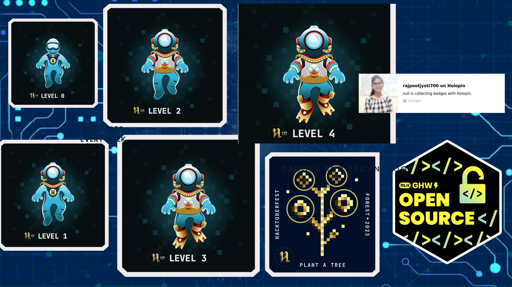

<h1 align="center">Hi 👋, I'm Jyoti Rajpoot</h1>
<h3 align="center">A passionate learner , java developer,coding Enthusiasts</h3>
</ul>
<h3 align="left">Open-Source Programs🌍</h3> 
<ul>
 
🌟<b>Hacktoberfest'23</b>🌈👩‍💻

 
  
  
  

- 📫 How to reach me **rajpootjyoti700@gmail.com**

- ⚡ Fun fact **not think but I m funny**

<h3 align="left">Connect with me:</h3>

<h3 align="left">Languages and Tools:</h3>

        

&nbsp;

